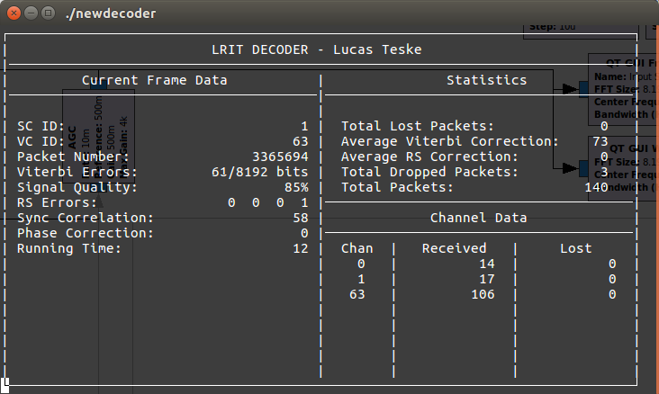

GOES LRIT Decoder
=================

This is the GOES LRIT Decoder. This works together with the demodulator by receiving a TCP Stream of the BPSK Symbols.
The output is a demuxed channel data at `channels/channel_{ID}.bin`.

It depends on **SatHelper** library either by a static link or shared link (see SatHelper folder for more info)

To compile just go to any of the folders `Debug`, `Release` or `Release Static` and run `make`.

Dependencies:

* [SatHelper](https://github.com/racerxdl/open-satellite-project/tree/master/SatHelper)