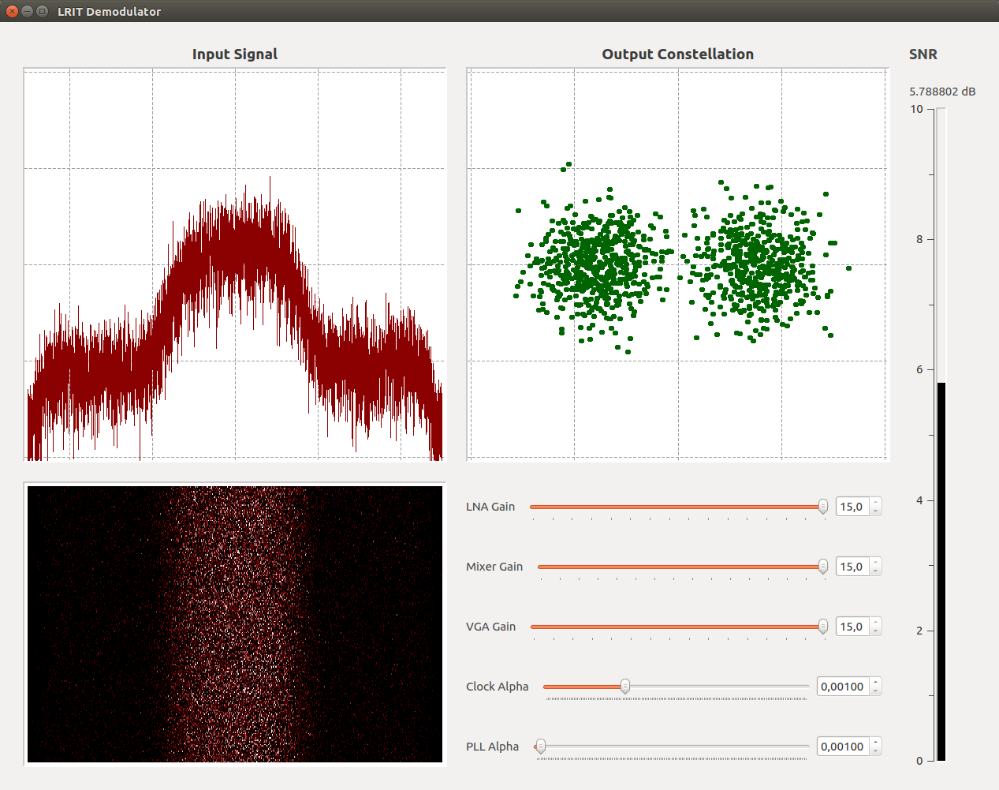

GOES LRIT Demodulator
=========================================

This is a GNU Radio Flow for Demodulating BPSK signals from GOES LRIT. The flow contains alternatives for Airspy R2 (default), Airspy Mini, GQRX Record and RTLSDR. The Base processing Sample Rate is 1msps, so you can adapt the flow to get your favorite SDR IQ to fit 1msps at 1691MHz. Have fun!

